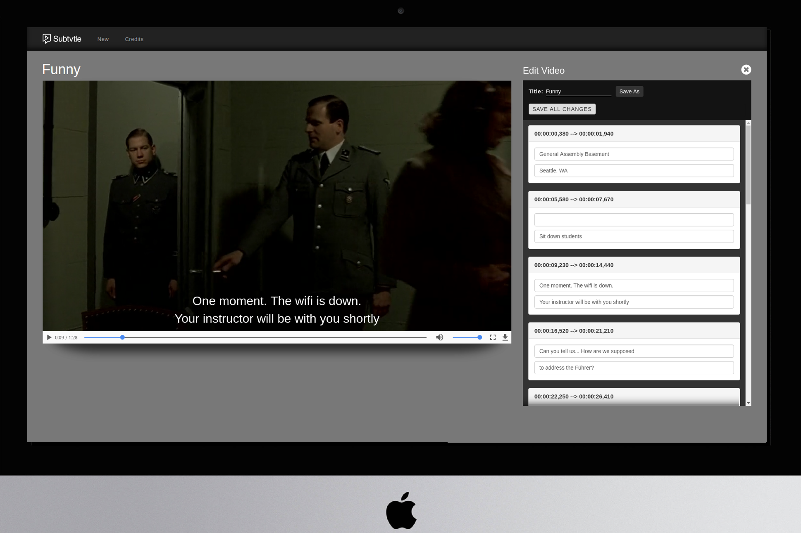

# Subtvtle
Original Subtitle project: <https://github.com/WDI-SEA/subtitles-solution>

Subtvtle is an application built on the Angular framework using MongoDB. The site
displays a short clip of a video and renders subtitles in front of the video.
The old site always showed subtitles as defined in a JavaScript file.
Users can alter displayed subtitles on the fly and save the edited text to a database. 
This project was built by the students at General Assembly Seattle WDI 11. 
We delegated tasks to small teams of two programmers and used version control to collaborate 
and design the application to spec.




Our website has:
* **homepage** - displays a list of all subtitle variations.
* **watch page** - a page that plays the video with one subtitle variation.
* **edit page** - a page that allows users to edit a subtitle variation.

The homepage includes an option to create a new subtitle variation. Users
have the option to choose whether they want to create subtitles from
a blank template, or copy another subtitle variation to use as a starting point.

Angular is an effective choice for our front end work because we'll be able to
easily display a list of all the current subtitles, allow users to change
subtitles inline and instantly see the effect of their change.

Mongoose is an effective choice for a database because we'll be able to
easily store our complex subtitle JSON objects without putting too much
effort into a database design.


## Reading Current Video Time Inside Angular
Angular and the video element may not play nicely together naturally. You'll
probably need to use vanilla JavaScript to obtain a reference to the video
element inside a controller, then use Angular's $interval service to constantly
read the time.

Don't use jQuery!

## Install

```sh
npm install
nodemon
```

## Licensing
All content is licensed under a CC­BY­NC­SA 4.0 license.
All software code is licensed under GNU GPLv3. For commercial use or alternative licensing, please contact legal@ga.co.
